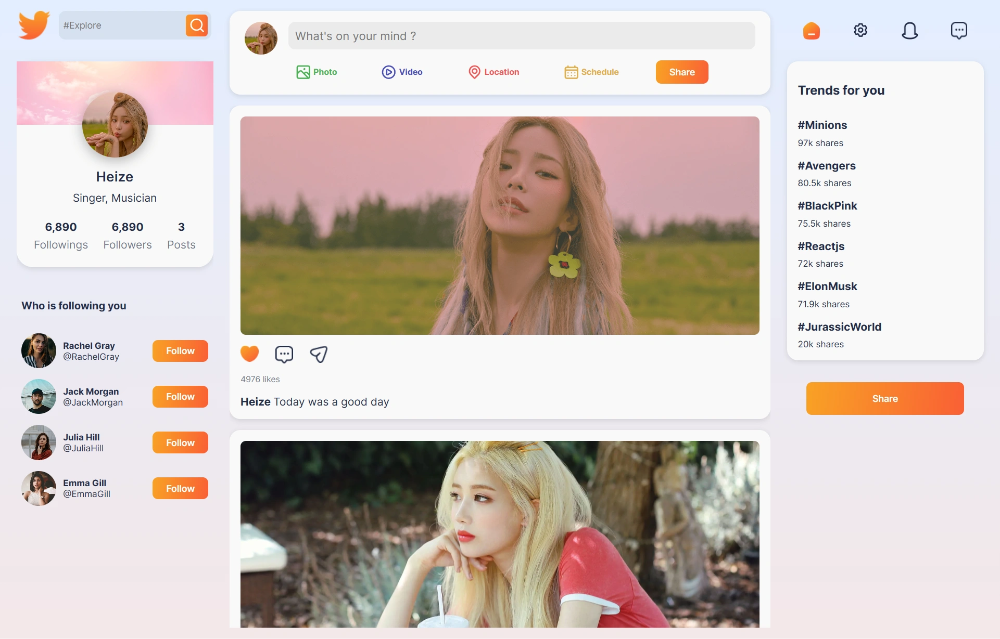

<div align="center">
    <a href="" target="_blank">
      
    </a>
  <h3 align="center">KPOP Social UI</h3>
</div>

##  <br /> 📋 <a name="table">Table of Contents</a>

- ✨ [Introduction](#introduction)
- ⚙️ [Tech Stack](#tech-stack)
- 📝 [Features](#features)
- 🚀 [Quick Start](#quick-start)

##  <br /> <a name="introduction">✨ Introduction</a>

**[EN]** User interface design for a social media platform inspired by the vibrant aesthetic of Kpop culture. Built with React, it features cozy, girly color palettes and aesthetics. Leveraging the Mantine library and complemented by Unicons, it aims to deliver an engaging and visually appealing user experience.

**[FR]** Design pour un réseau social inspiré par l'esthétique vibrante de la culture Kpop. Développé avec React, il intègre une palette de couleurs "girly". Utilisant la bibliothèque Mantine et complété par Unicons, l'objectif est de fournir une expérience utilisateur engageante et visuellement attrayante.

##  <br /> <a name="tech-stack">⚙️ Tech Stack</a>

- **React** is a popular JavaScript library for building user interfaces, particularly single-page applications where data changes over time. React's component-based architecture allows developers to create reusable UI components, making development more efficient and the codebase easier to maintain. 


## <br /> <a name="quick-start">🚀 Quick Start</a>

Follow these steps to set up the project locally on your machine.

<br/>**Prerequisites**

Make sure you have the following installed on your machine:

- [Git](https://git-scm.com/)
- [Node.js](https://nodejs.org/en)
- [npm](https://www.npmjs.com/) (Node Package Manager)

<br/>**Cloning the Repository**

```bash
git clone {git remote URL}
```

<br/>**Installation**

Let's install the project dependencies, from your terminal, run:

```bash
npm install
# or
yarn install
```

<br/>**Running the Project**

Installation will take a minute or two, but once that's done, you should be able to run the following command:

```bash
npm start
# or
yarn start
```

Open [`http://localhost:3000`](http://localhost:3000) in your browser to view the project.